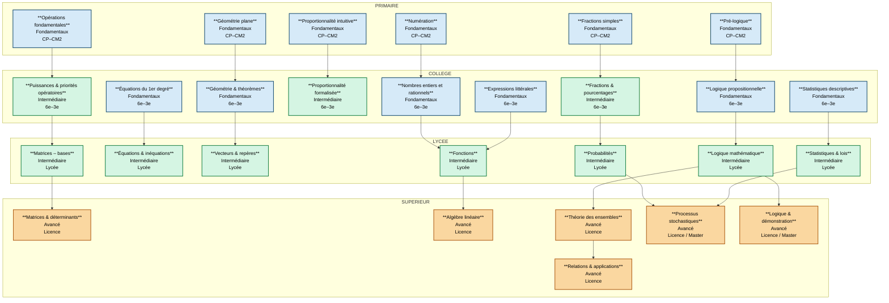

# Organigramme global des mathématiques (Mermaid - graph TD)

```mermaid
graph TD

%% ===================== STYLES =====================
classDef fondamentaux fill:#D6EAF8,stroke:#1B4F72,stroke-width:2px,color:#000000;
classDef intermediaire fill:#D5F5E3,stroke:#1E8449,stroke-width:2px,color:#000000;
classDef avance fill:#FAD7A0,stroke:#AF601A,stroke-width:2px,color:#000000;

classDef niveau fill:#F2F2F2,stroke:#BDBDBD,stroke-width:2px,color:#424242;

%% ===================== PRIMAIRE =====================
subgraph PRIMAIRE
direction TB
class PRIMAIRE niveau

N1["**Numération**<br/>Fondamentaux<br/>CP–CM2"]:::fondamentaux
O1["**Opérations fondamentales**<br/>Fondamentaux<br/>CP–CM2"]:::fondamentaux
F1["**Fractions simples**<br/>Fondamentaux<br/>CP–CM2"]:::fondamentaux
P1["**Proportionnalité intuitive**<br/>Fondamentaux<br/>CP–CM2"]:::fondamentaux
L1["**Pré-logique**<br/>Fondamentaux<br/>CP–CM2"]:::fondamentaux
G1["**Géométrie plane**<br/>Fondamentaux<br/>CP–CM2"]:::fondamentaux
end

%% ===================== COLLEGE =====================
subgraph COLLEGE
direction TB
class COLLEGE niveau

N2["**Nombres entiers et rationnels**<br/>Fondamentaux<br/>6e–3e"]:::fondamentaux
O2["**Puissances & priorités opératoires**<br/>Intermédiaire<br/>6e–3e"]:::intermediaire
F2["**Fractions & pourcentages**<br/>Intermédiaire<br/>6e–3e"]:::intermediaire
P2["**Proportionnalité formalisée**<br/>Intermédiaire<br/>6e–3e"]:::intermediaire
A2["**Expressions littérales**<br/>Fondamentaux<br/>6e–3e"]:::fondamentaux
E2["**Équations du 1er degré**<br/>Fondamentaux<br/>6e–3e"]:::fondamentaux
G2["**Géométrie & théorèmes**<br/>Fondamentaux<br/>6e–3e"]:::fondamentaux
S2["**Statistiques descriptives**<br/>Fondamentaux<br/>6e–3e"]:::fondamentaux
L2["**Logique propositionnelle**<br/>Fondamentaux<br/>6e–3e"]:::fondamentaux
end

%% ===================== LYCEE =====================
subgraph LYCEE
direction TB
class LYCEE niveau

A3["**Fonctions**<br/>Intermédiaire<br/>Lycée"]:::intermediaire
E3["**Équations & inéquations**<br/>Intermédiaire<br/>Lycée"]:::intermediaire
V3["**Vecteurs & repères**<br/>Intermédiaire<br/>Lycée"]:::intermediaire
M3["**Matrices – bases**<br/>Intermédiaire<br/>Lycée"]:::intermediaire
P3["**Probabilités**<br/>Intermédiaire<br/>Lycée"]:::intermediaire
S3["**Statistiques & lois**<br/>Intermédiaire<br/>Lycée"]:::intermediaire
L3["**Logique mathématique**<br/>Intermédiaire<br/>Lycée"]:::intermediaire
end

%% ===================== SUPERIEUR =====================
subgraph SUPERIEUR
direction TB
class SUPERIEUR niveau

M4["**Matrices & déterminants**<br/>Avancé<br/>Licence"]:::avance
A4["**Algèbre linéaire**<br/>Avancé<br/>Licence"]:::avance
T4["**Théorie des ensembles**<br/>Avancé<br/>Licence"]:::avance
R4["**Relations & applications**<br/>Avancé<br/>Licence"]:::avance
P4["**Processus stochastiques**<br/>Avancé<br/>Licence / Master"]:::avance
L4["**Logique & démonstration**<br/>Avancé<br/>Licence / Master"]:::avance
end

%% ===================== LIENS =====================
N1 --> N2
O1 --> O2
F1 --> F2
P1 --> P2
L1 --> L2
G1 --> G2

N2 --> A3
A2 --> A3
E2 --> E3
G2 --> V3
S2 --> S3
L2 --> L3
O2 --> M3
F2 --> P3

M3 --> M4
A3 --> A4
L3 --> L4
P3 --> P4
S3 --> P4
L3 --> T4
T4 --> R4
```
